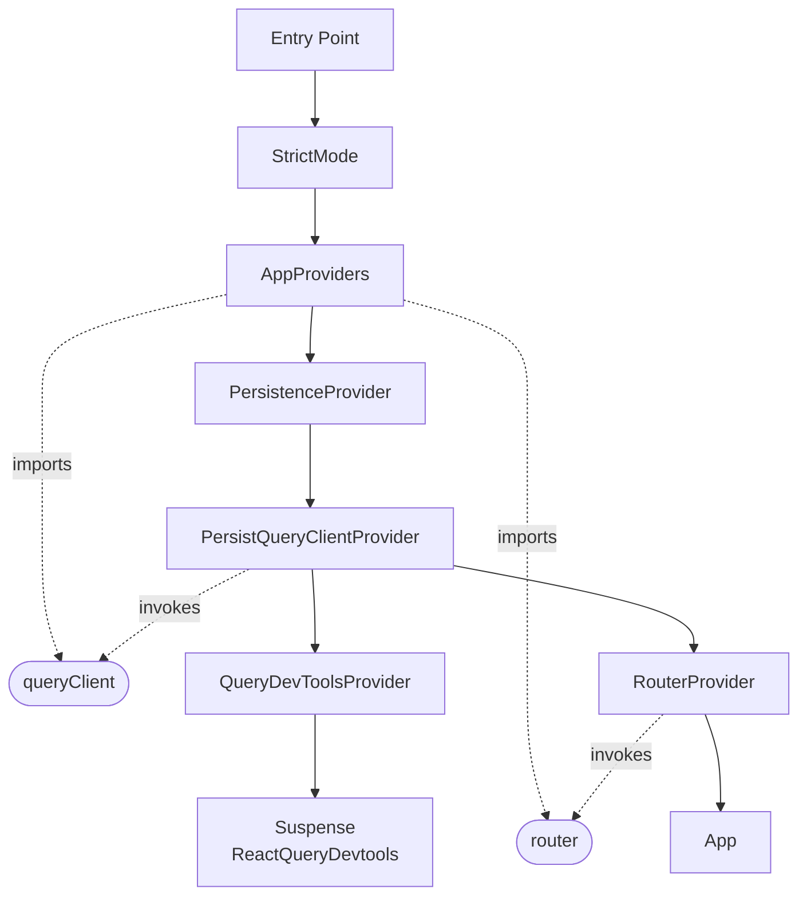
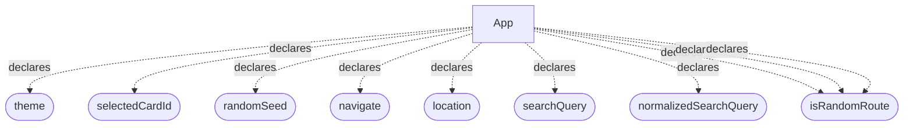

# Charles' Binder Components Structure

## Main and Providers components

```mermaid
flowchart TD

M[Entry Point]
M --> SM["StrictMode"]

SM --> AP["AppProviders"]

AP --> PP["PersistenceProvider"]
AP -.->|"imports"| qC(["queryClient"])
AP -.->|"imports"| r(["router"])

PP --> PQCP["PersistQueryClientProvider"]

PQCP --> QDTP["QueryDevToolsProvider"]
PQCP --> RP["RouterProvider"]
PQCP -.->|"invokes"| qC

QDTP --> RQD["Suspense <br/> ReactQueryDevtools"]

RP -.-> |"invokes"| r
RP --> A["App"]
```

## App, navigation, and features

```mermaid
flowchart TD
A[App]
A -.-> |declares| t(["theme"])
A -.-> |declares| sCI(["selectedCardId"])
A -.-> |declares| rS(["randomSeed"])
A -.-> |declares| nA(["navigate"])
A -.-> |declares| uL(["location"])
A -.-> |declares| sQ(["searchQuery"])
A -.-> |declares| nSQ(["normalizedSearchQuery"])
A -.-> |declares| isRR(["isRandomRoute"])
A -.-> |declares| isRR(["isRandomRoute"])
A -.-> |declares| isRR(["isRandomRoute"])
```
